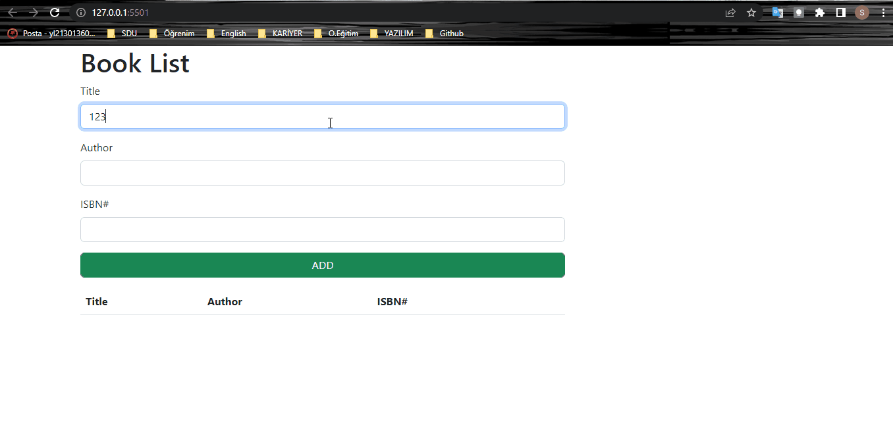

# BOOK LIST PROJECT 
---
In this project;  **HTML**, **CSS**, **JS**, and **Bootstrap** were used. You can add books with titles, authors, and ISBN numbers. Whether you add successfully or not you take an alert message depending on the situation's success or failure. Also because book lists were saved to Local Storage when you reload the page you can still see the added lists before.

---

  
